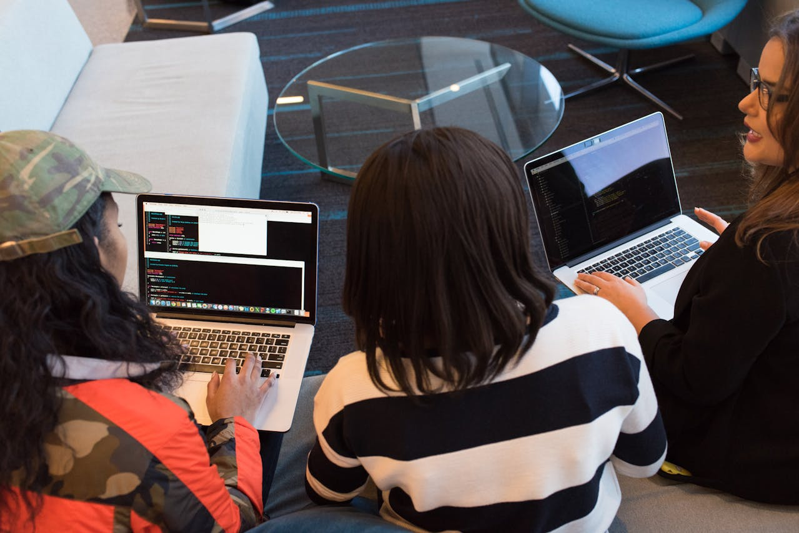

# AMOA Courses 🎓

> Empowering educators and learners with a modern, flexible online course platform.


---

## Table of Contents

- [About](#about)
- [Key Features](#key-features)
- [Screenshots](#screenshots)
- [Live Demo](#live-demo)
- [Tech Stack](#tech-stack)
- [Architecture Overview](#architecture-overview)
- [Getting Started](#getting-started)
- [Environment Variables](#environment-variables)
- [Usage Guide](#usage-guide)
- [API Reference](#api-reference)
- [Testing](#testing)
- [Contributing](#contributing)
- [License](#license)
- [Acknowledgements](#acknowledgements)

---

## About

**AMOA Courses** is a robust, open-source platform designed for both educators and students to create, manage, and participate in online courses. Whether you are a teacher looking to share knowledge or a student eager to learn, AMOA Courses provides an intuitive, scalable environment for digital education.

- **Who is it for?**  
  Teachers, trainers, schools, and independent learners who want a streamlined, interactive online learning experience.

- **Why does it exist?**  
  To simplify the process of creating, delivering, and tracking educational content and progress in a collaborative, modern web environment.

- **What problem does it solve?**  
  AMOA Courses bridges the gap between educators and students by offering real-time course management, progress analytics, and engaging assessment tools—all in one place.

---

## Key Features

- **Course Management:**  
  Create, edit, and organize courses with modular lessons, quizzes, and assignments.

- **Lesson and Quiz Builder:**  
  Add multimedia lessons, interactive quizzes, and custom assignments to enhance learning.

- **Student & Teacher Profiles:**  
  Personalized dashboards for tracking progress, submissions, and feedback.

- **Progress Analytics:**  
  Visualize learning outcomes and monitor student engagement with real-time analytics.

- **Assignment Submission & Grading:**  
  Students can submit assignments; teachers can review, grade, and provide feedback.

- **Role-based Access:**  
  Secure authentication and authorization for students and teachers.

- **Responsive UI:**  
  Mobile-friendly design built with Tailwind CSS for seamless access on any device.

- **Accessibility:**  
  Designed with accessibility standards for inclusive learning.

- **Extensible:**  
  Easily add new features or integrate with third-party tools.

---

## Screenshots

> _Showcase your platform in action!_




---

## Live Demo

Experience the platform live:  
[View Live Demo](https://amoa-courses.vercel.app/)

---

## Tech Stack

- **Frontend:**

  - [Next.js](https://nextjs.org/) (React 19)
  - [Tailwind CSS](https://tailwindcss.com/)
  - [Radix UI](https://www.radix-ui.com/)
  - [Lucide Icons](https://lucide.dev/)
  - TypeScript

- **Backend:**

  - Next.js API routes
  - [MongoDB](https://www.mongodb.com/)
  - [Mongoose](https://mongoosejs.com/)
  - [Zod](https://zod.dev/) (schema validation)

- **Other:**
  - [React Hook Form](https://react-hook-form.com/)
  - [Axios](https://axios-http.com/)
  - [Sonner](https://sonner.emilkowal.ski/) (notifications)

---

## Architecture Overview

The AMOA Courses platform is organized as a modern monorepo using Next.js App Router. Key architectural highlights:

- **Modular Components:**  
  Reusable UI and logic components for rapid development.

- **API Layer:**  
  Secure, RESTful endpoints for course, lesson, quiz, and user management.

- **Database:**  
  MongoDB for scalable, flexible data storage.

- **Authentication:**  
  (If present) JWT or session-based authentication for secure access.

- **State Management:**  
  React Context and hooks for global state.

- **Testing:**  
  (If present) Unit and integration tests using Jest or similar.

---

## Getting Started

### Prerequisites

- Node.js (18 or higher)
- MongoDB (4.4 or higher)

### Installation

``bash
git clone [https://github.com/yourusername/amoa-courses.git](https://github.com/yourusername/amoa-courses.git)
cd amoa-courses
npm install
npm run dev

```

### Environment Variables

Create a `.env` file in the root directory and add the following variables:

```

MONGODB_URI=your_mongodb_uri
NEXT_PUBLIC_API_URL=http://localhost:3000

```

### Usage

### As a Teacher

1. Register and log in.
2. Create a new course and add lessons, quizzes, and assignments.
3. Invite students or share course links.
4. Track student progress and provide feedback.

### As a Student

1. Sign up and enroll in available courses.
2. Complete lessons, quizzes, and assignments.
3. View progress and receive grades or feedback.
```

## Acknowledgements

- [Next.js](https://nextjs.org/) - The React framework used for building the application.
- [MongoDB](https://www.mongodb.com/) - The database used for storing application data.
- [Mongoose](https://mongoosejs.com/) - The ODM (Object Data Modeling) library used for MongoDB integration.
- [Zod](https://zod.dev/) - The schema validation library used for data validation.
- [React Hook Form](https://react-hook-form.com/) - The form management library used for handling form inputs.
- [Axios](https://axios-http.com/) - The HTTP client used for making API requests.
- [Sonner](https://sonner.emilkowal.ski/) - The notification library used for displaying notifications.
- [Lucide Icons](https://lucide.dev/) - The icon library used for adding icons to the application.
- [Radix UI](https://www.radix-ui.com/) - The component library used for building the UI.
- [Tailwind CSS](https://tailwindcss.com/) - The CSS framework used for styling the application.

---

## License

[MIT License](https://choosealicense.com/licenses/mit/)
